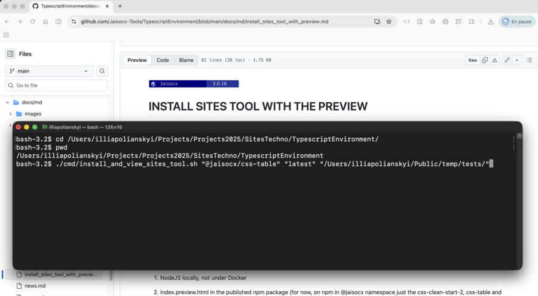
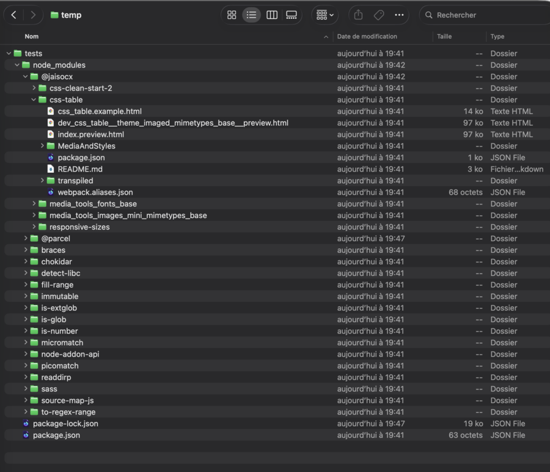

# INSTALL SITES TOOL WITH THE PREVIEW

[README.md HOME](./../../README.md)


## For what the preview command line bash script tool

*To open in browser at once, and the automatique installation to node_modules other js packages 
for the site example with the preview of a sites tool*.

A typescript sites tool can require other js libraries, 
for example `@jaisocx/css-clean-start-2` 
for the site's look and feel in the `index.preview.html`.

Our preview command line bash tool solved the encountered problem: 
if a js library, like a sites tool, was installed, 
its other required js libraries ( `package.json` dependencies )
are not always installed to the `node_modules` on same level in the installation folder, 
and then the `index.preview.html` wasn't rendered in browser the right way.

When we already have written this command line bash tool, 
then added there just several bash code lines to open at once the installed preview in a sites browser 
for the finer performance and user experience.


## Installation screenshots

### 1. install the preview via command line



### 2. command infos in terminal after installation


### 3. the preview opens in browser


### 4. how the filesystem folder looks after the preview was installed

*I appologize for known bugs, bugfixes come later.*

**With fonts feature for Css Clean Start quality, the SASS styles preprocessor is installed**
> I improved install of the CssCleanStart with fonts, 
> however didn't notice, 
> that the Css Clean Start and other @jaisocx previews 
> have installed also SASS styles preprocessor, 
> needed just in build time of the @jaisocx fonts library,
> in order to work with styles variables of paths and urls pointing to fonts .ttf files.
>
> The CSS3 variables don't do according to documentation and other fine logic, 
> and SASS and SCSS can work with variables for urls or filesystem paths,
> however require normal installation of SASS styles preprocessor of very many folders with .js libraries.
> 
> The bugfix to require just one or two @jaisocx packages 
> for a preview install of one sites tool 
> was set in tasks for later in several weeks.


**in a subfolder with package.json some level above, the preview installs there above and doesn't show in browser**
> Another thing was, 
> when there is a package.json in a folder above, 
> the preview script installs, but doesn't find the .html file neither shows the preview in browser, 
> since the preview is installed there many levels higher in some another node_modules folder.




## Another fine feature

The script works without referencing other .sh scripts.
You can just copy this script file standalone and install later by npm any sites tools with preview in browser.


## Required
1. NodeJS locally, not under Docker

2. index.preview.html in the published npm package (for now, on npm in @jaisocx namespace just the css-clean-start-2, css-table and css-table-ordered)


The script can run if NodeJS is installed locally, not in the Dockerized ts service here,
since the preview may be of great use when installing a sites tool for a preview and tests in another project too, not the Sandbox.

Why without Docker: when at once writing the script for the dockerized node services,
I don't have for now the idea of script args
for eventually installed other docker services names, paths on host and in docker services, and when without docker.


## Call of this Command line shell bash tool explained

1. npm package name
2. npm package ver number or "latest"
3. path to the folder where You'd like to install the sites tool, maybe just for the preview or tests temporarily.
4. example .html file name, if other than `index.preview.html`

```bash
./cmd/install_and_view_sites_tool.sh "@jaisocx/css-clean-start-2" "latest" "/home/user/projects/preview"
```

```bash
./cmd/install_and_view_sites_tool.sh "@jaisocx/css-clean-start-2" "1.2.5" "/home/user/projects/preview" "other_preview_to_open.html"
```

